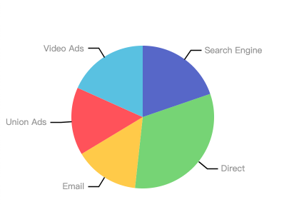

# [@vislite/chart](https://github.com/oi-contrib/vislite-plugin-chart)
一些常用的可视化图表库

<p>
    <a href="https://zxl20070701.github.io/toolbox/#/npm-download?packages=@vislite/chart&interval=7">
        
    </a>
    <a href="https://www.npmjs.com/package/@vislite/chart">
        
    </a>
    <a href="https://github.com/oi-contrib/vislite-plugin-chart/issues">
        
    </a>
    <a href="https://github.com/oi-contrib/vislite-plugin-chart" target='_blank'>
        
    </a>
    <a href="https://github.com/oi-contrib/vislite-plugin-chart">
        
    </a>
     <a href="https://gitee.com/oi-contrib/vislite-plugin-chart" target='_blank'>
        
    </a>
    <a href="https://gitee.com/oi-contrib/vislite-plugin-chart">
        
    </a>
</p>


## 如何使用？

```
npm install --save @vislite/canvas
```

安装后，准备好渲染位置

```html
<div id="root" style="width:400px;height:400px"></div>
```

然后直接使用（以饼图为例）：

```js
import {SimplePie} from "@vislite/chart"
let pie = new SimplePie({
    el: document.getElementById("root"),
    data: [
        { value: 1048, name: 'Search Engine' },
        { value: 735, name: 'Direct' },
        { value: 580, name: 'Email' },
        { value: 484, name: 'Union Ads' },
        { value: 300, name: 'Video Ads' }
    ]
})
```

这样一个饼图就出来了:



下面是更多图表明细：

- [SimplePie 基本饼图](./docs/SimplePie.md)

## 版权

MIT License

Copyright (c) [zxl20070701](https://zxl20070701.github.io/notebook/home.html) 走一步，再走一步