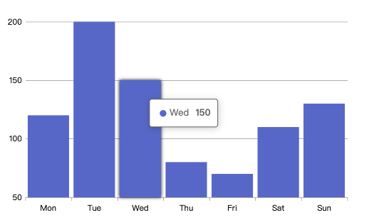

# Bar 直方图

> v1.1.0 新增

```js
import { Bar } from "@vislite/chart"
let bar = new Bar({
    el: document.getElementById("root"),
    xAxis: {
        value: ["Mon", "Tue", "Wed", "Thu", "Fri", "Sat", "Sun"]
    },
    data: [120, 200, 150, 80, 70, 110, 130]
})
```

完整的例子代码你可以访问： [../test/Bar.html](../test/Bar.html) ，下面是运行截图：



## 方法

### setData

动态修改数据：

```js
bar.setData([10, 100, 50, 80, 170, 40, 30])
```

## 配置项

### el

原始挂载点。

### data

数据。