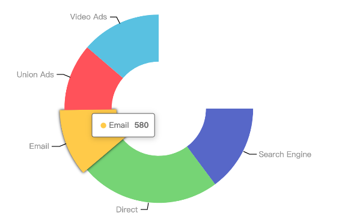

# Pie 饼图

```js
import { Pie } from "@vislite/chart"
let pie = new Pie({
    el: document.getElementById("root"),
    data: [
        { value: 1048, name: 'Search Engine' },
        { value: 735, name: 'Direct' },
        { value: 580, name: 'Email' },
        { value: 484, name: 'Union Ads' },
        { value: 300, name: 'Video Ads' }
    ],
    isRing: true,
    beginDeg: 0,
    deg: Math.PI * 1.5
})
```

完整的例子代码你可以访问： [../test/Pie.html](../test/Pie.html) ，下面是运行截图：



## 方法

### setData

动态修改数据：

```js
pie.setData([
    { value: 108, name: 'Search Engine' },
    { value: 175, name: 'Direct' },
    { value: 80, name: 'Email' },
    { value: 84, name: 'Union Ads' },
    { value: 100, name: 'Video Ads' }
])
```

## 配置项

### el

原始挂载点。

### data

数据。

### isRing

> v1.1.0 新增

boolean类型，默认false，表示是否是环图。

### beginDeg
> v1.1.0 新增


开始弧度位置，默认 `-0.5 * Math.PI` 。

### deg

> v1.1.0 新增

图形跨越弧度，默认 `2 * Math.PI` 。